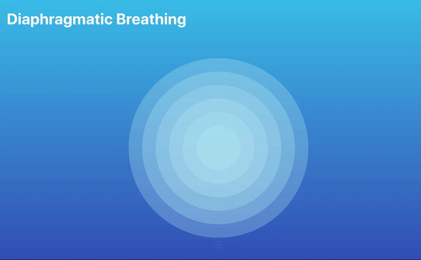

# jihu0947-individual-work
## How to Interact With the Work
This sketch automatically animates on load. You do not need to click or interact manually. Open the GitHub Pages link and run the code in the p5.js editor to view.
The following animated effects will appear:
- Falling mandala circles with visible trails
- Entire canvas harmonic rotation
- Canvas scaling
- Gentle left-right sway motion
- Size pulsing over time
- Transparency pulsing
All animations are time-based, driven by frameCount with sin().
# Individual Design Details (Time-Based)
## Differences from the Group Work
In my individual submission, I animate several time-based properties of the work, making my version different from those of other group members.

- canvas level 

I animate the entire canvas, adding harmonic rotation and a sine-wave-driven scaling effect.

- shape level 

I add independent size pulses and transparency pulses to each circle.

- position level 

I use millis() to add a horizontal sway and to make each ring rotate slightly as it falls.
In general, the time-based animation effects are enriched on the basis of group work, forming different visual feelings.
## Animation Inspiration

- Harmonic Motion & Oscillation

The entire time-based animation is inspired by harmonic motion(y = A * sin(ωt + φ)), where sine waves create gentle oscillations over time. This regular motion is added to the animation of the canvas and the circles themselves to create a rhythmic visual effect.

- Breathing Circle

The pulsing size changes and transparency fluctuations of each ring are inspired by the breathing circle image, where smooth scaling represents inhale–exhale cycles. This guides my decision to animate radius and transparency using periodic sine-wave motion.

## Technical Explanation
1. **Using sin(), rotate(), scale() and frameCount to make canvas harmonic motion** 

This part is inspired by the sketch of p5.js to realize the canvas oscillation of rotation and jumping scaling. Function sin() outputs values between 1 and -1, producing a natural periodic motion. Feeding frameCount into sin() and using rotate() and scale() to generate continuous harmonic animation over time.
[Reference Link](https://editor.p5js.org/ks1439/sketches/jiL7AeR0T)

2. **Using millis() with sin() to achieve circles horizontal sway over time**

Function millis() provides time in milliseconds, ensuring movement is independent of frame rate. This produces a smoother, natural sway of circles than using frameCount alone.
[Reference Link](https://p5js.org/reference/p5/millis/)

3. **Size pulsing and transparency change over time using sin() and frameCount**

Use sine waves to rhythmically change the size and transparency of each ring.

4. **Changes made to the group code**

To change the falling mandalas into a time-based animation, I implement the following modifications to the group work:
- Modify drawCircle(), drawAura(), and drawDotMandala() to accept animated parameters (currentR, alphaPulse).Change ring.r to currentR.
- Add a low-alpha background to have a visible trail.
- Translate the coordinate system to the center of the ring. Replace ring.x and ring.y with 0, and ring.r with currentR.

The techniques used in this sketch come from the class and the p5.js website.
 